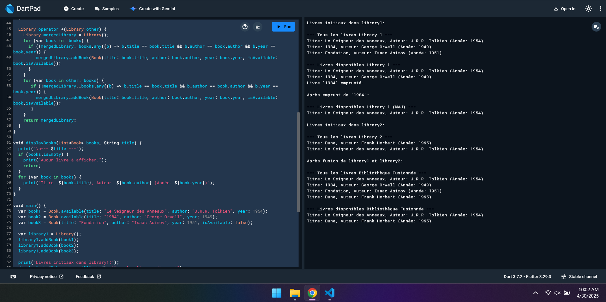
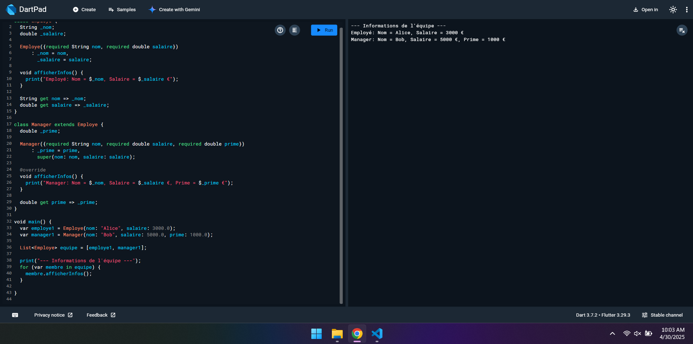
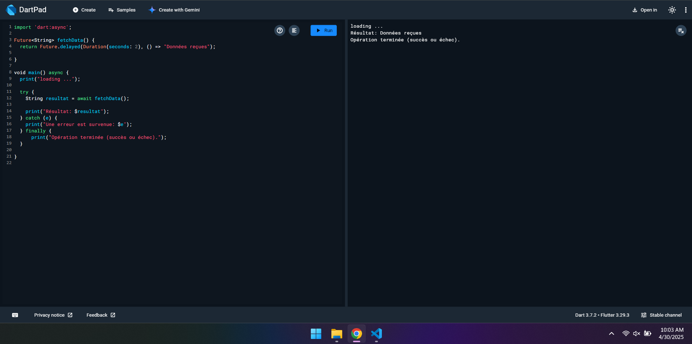

# Dart Exercises Project

This project contains several Dart exercises demonstrating various language features.

## Exercise 1: Library Management (`exercise1.dart`)

This exercise demonstrates basic Object-Oriented Programming concepts in Dart, including classes (`Book`, `Library`), constructors, methods, list manipulation, and operator overloading (`+` for `Library`). It simulates managing books in a library, including adding, borrowing, and merging libraries.

**Output Screenshot:**

## Exercise 2: Employee Hierarchy (`exercise2.dart`)

This exercise focuses on inheritance and polymorphism. It defines an `Employe` base class and a `Manager` derived class, showcasing method overriding (`afficherInfos`), getters, and how polymorphism works with a list containing objects of both types.

**Output Screenshot:**

## Exercise 3: Asynchronous Data Fetching (`exercise3.dart`)

This exercise showcases asynchronous programming in Dart using `Future`, `async`, and `await`. It simulates fetching data after a delay and handles potential errors using `try-catch-finally`.

**Output Screenshot:**

